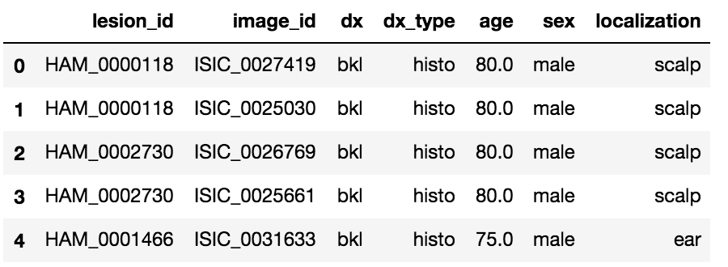
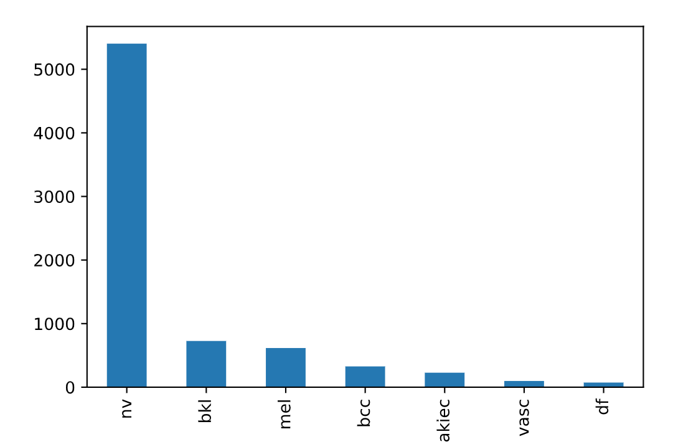
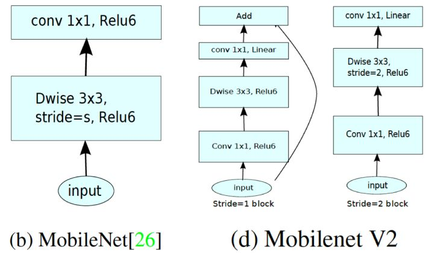

# Skin Lesion Analyzer

### What is this all about?
The aim of this project is to detect **skin lesions** using a deep learning model. This project is a part of the ongoing **[#PoweredByTF 2.0 Challenge! ](https://tensorflow.devpost.com/)**. As the challenge is based on TF2.0, our aim is to build something in order to showcase:
* The ease of using TF2.0
* The power and simplicity of **Keras**
* The exceptional **tflite** framework

### Introduction
Any type of cancer is somehow deeply dangerous if not deadly. To see how bad the situation is, let us look at some of the stats given by the [skin cancer organization](https://www.skincancer.org/skin-cancer-information/):
* One in five Americans will develop skin cancer by the age of 70
* Actinic keratosis is the most common precancer; it affects more than 58 million Americans
* The annual cost of treating skin cancers in the U.S. is estimated at $8.1 billion: about $4.8 billion for nonmelanoma skin cancers and $3.3 billion for melanoma.
* Skin cancer represents approximately 2 to 4 percent of all cancers in Asians
* Skin cancer represents 4 to 5 percent of all cancers in Hispanics
* Skin cancer represents 1 to 2 percent of all cancers in blacks

### Problem
Analyzing cancers isn't an easy task. It requires intensive examining. More than 50% of lesions are confirmed through histopathology (histo), the ground truth for the rest of the cases is either follow-up examination (follow_up), expert consensus (consensus), or confirmation by in-vivo confocal microscopy (confocal). The lack of experts(radiologists) has always been a bottleneck. Now there are three things that we have to consider here:
* Given the fact that there are a limited number of experts, how can we make them more efficient? Can we aid them using state of the art machine learning techniques? If yes, how?
* Training of neural networks for automated diagnosis of pigmented skin lesions is hampered by the small size and lack of diversity of available dataset of dermatoscopic images. Labelled data in healthcare is another bottleneck. With the available limited data, how much can we do?

As a Machine Learning Engineer, if we can't help the doctors and ultimately society, then what are we good at? Healthcare is a complicated field and using Machine Learning in this field has its own *advantages* and *disadvantages*. There is a limit to which we can do things with ML in healthcare. In conclusion, this matters!

### Dataset
The dataset is a part of [Kaggle Datasets](https://www.kaggle.com/kmader/skin-cancer-mnist-ham10000). A big thank you to **Kevin Mader** for uploading this dataset to kaggle.
The dataset comprises of a total of **10,000** images stored in two folders. The information about the data is stored in a dataframe which looks like this:

<figure>
  
  <figcaption></figcaption>
</figure>

There are a total of **7 classes** of skin cancer in the dataset. After removing the duplicates we were left with around **~8K samples**. Checking the final distribution as shown below, we found out that the dataset is **highly imbalanced** which poses another challenge. For detailed notes, please check the **EDA notebook** in the notebooks directory

<figure>
  
  <figcaption></figcaption>
</figure>

## Architecture
The ultimate aim of this project was to get a model that can run on mobile phones. In this regard, the only choices of architecture we had were: Mobilenet_v1, MobileNet_v2, M-Nasnet, and Shufflenet. We focused on the mobilenets family as they are readily available in the keras model zoo. I chose MobileNetv2 as it much faster on mobile as compared to mobilenet_v1

<figure>
  
  <figcaption></figcaption>
</figure>

The base network was used for feature extractor, excluding all the top layers that were responsible for classification. In mobilenets, the last layer for feature extraction is `global average pooling`, hence we discard all the layers beyond this point. The task of training the model was completed into two phases:
* **Transfer learning** where we added new layers on the top of the base network and trained the new layers while keeping the base network in the frozen state.
* **Fine-tuning** where we unfreeze some of the layers of the base network for improved gains. 
